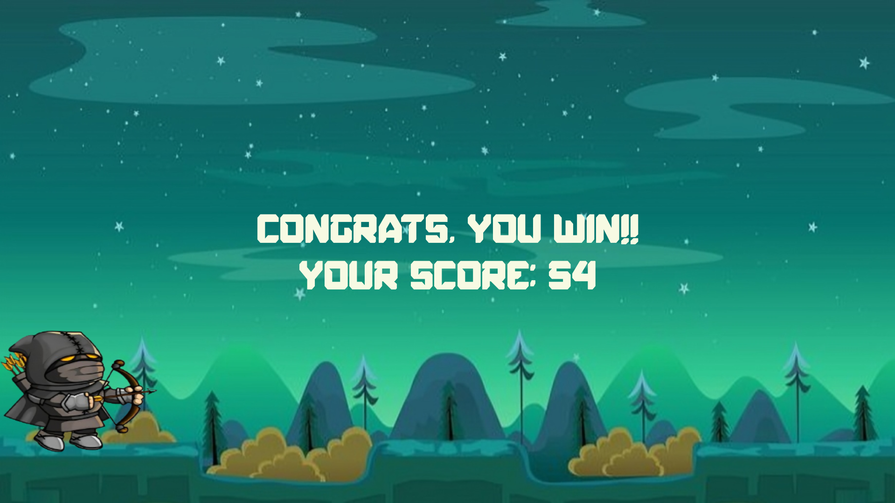

# Bow and Arrow Game


Welcome to the Bow and Arrow Game, where your aim determines your success! Get ready for the ultimate test of accuracy and nerve as you aim carefully and pop balloons with your bow – every shot counts!

# Table of Contents
- [Introduction](#introduction)
- [Controls](#controls)
- [Gameplay](#gameplay)
- [Code Structure](#code-structure)
- [UML](#uml)
- [Features](#features)
- [Licenses](#licenses)

## Introduction
Welcome to our Bow and Arrows game! This game offers an exciting archery experience where players try to hit targets using a bow and arrow. There are different difficulty levels to choose from, exciting gameplay features, and a limited supply of arrows, making each shot require skill and planning. In this guide, you will discover all the information you need to begin playing the game, such as controls, how the game works, and strategies to make the most of your arrows. So, grab your bow, aim carefully, and challenge yourself in this immersive and challenging game!

## Controls

- To control your character's vertical movement, simply move the mouse up or down.
- To shoot arrows at balloons:
 Reload the arrow *(Character position 1)* by right-clicking the mouse, to shoot the arrow *(Character position 2)* by left-clicking the mouse.
- Repeat these steps for each arrow.

- **Position 1**

<div style="display:flex">


</div>

- **Position 2**

<div style="display:flex">


</div>


## Gameplay

### Level 1

- Game starts with Options (you choose the difficulty of the level you want: easy, medium, or hard by left-clicking the mouse), then level 1 starts.
- **Balloons:** Red balloons move regularly and at the same speed.
- You have 20 arrows and 15 red balloons. Whenever you shoot an arrow or an arrow collides with a balloon,The score is calculated by: ```Score = (Remaining Arrows + 1) * Number of Shot Balloons```
- If you use all the arrows and the arrows do not collide with all the balloons, then you have lost and get **"Sorry, you failed"** along with your score. You can retry the level by left-clicking the mouse on the **"Retry"** button, then you can choose the difficulty you want.
- If all the balloons collide with the arrows, then you have succeeded and  get **"Congrats, you win!"** along with your score. You can move to level 2 by left-clicking the mouse on the **"Next level"** button, then you can choose the difficulty for the new level.

<div style="display:flex">


</div>


### Level 2

- In level 2, you can move the character, load arrows, and fire them in the same ways as in level 1.
- **Balloons:** There are two types of balloons, red and yellow **(3 yellow balloons + 12 red balloons)** , and they all move randomly. The yellow balloons move with acceleration, while the red ones move with a constant speed.
- When an arrow collides with a yellow balloon, the score is increased by 10 points.
- ```Score = (Remaining Arrows + 1) * Number of Shot Red Balloons + Number of Shot Yellow Balloons * 10 ```
- If you use all the arrows and the arrows do not collide with all the balloons, then you have lost and get **"Sorry, you failed"** along with your score. You can retry the level by left-clicking on the mouse on the **"Retry"** button, then you can choose the difficulty you want as level 1.
- If all the balloons (Red and Yellow) collide with the arrows, then you have succeeded, get **"Congrats, you win!"** along with your score.


<div style="display:flex">


</div>

## Features

### Difficulty Levels and Collision Radius

Adjust the challenge to your skill level with three difficulty settings: easy, medium, and hard. Each difficulty level modifies the collision radius, affecting how close your arrow needs to be to a balloon to pop it. Test your precision and reflexes as you progress from beginner to expert!

<p align="center">

</p>


### Immersive Audio Experience

Immerse yourself in an audio-rich environment that enhances every aspect of the gameplay:

- **Engaging Background Music:** Elevate your gaming experience with captivating background music that sets the mood and entertains players as they navigate through the game. It keeps you engaged and focused throughout the experience.

- **Realistic Sound Effects:** Experience the satisfaction of popping balloons with immersive sound effects that bring the game to life. Hear the satisfying "pop" as your arrow hits its target, adding another layer of excitement to each shot. Each sound effect contributes to making your gameplay more enjoyable and memorable.

### Retry Game and Set Difficulty Again
Don't give up if you lose! With the option to retry the game, you can reset and try again. Choose a new difficulty level and challenge yourself to improve your skills. Whether you're a beginner or an expert archer, there's always room for improvement and another chance at victory!

<p align="center">
  
</p>


## License

-Classy Arrows is open-source software licensed under the [MIT License](LICENSE). Feel free to use, modify, and distribute this project for both personal and commercial purposes, as long as the original license terms are retained.


-The background music used in this project is sourced from the Game of Thrones series. All rights to the music belong to its respective copyright holder. The use of this music in this project is permitted under the terms of the license agreement obtained from the copyright holder.

